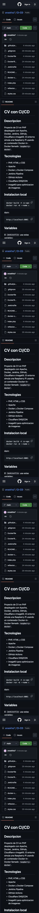
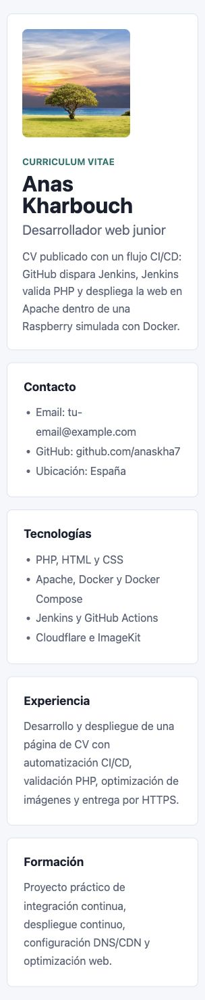

# CV con CI/CD

## Descripcion

Proyecto de CV en PHP desplegado con Apache, Docker, Jenkins, GitHub, Cloudflare e ImageKit. El entorno simula una Raspberry Pi usando un contenedor Docker-in-Docker llamado `raspberry-docker`.

## Tecnologias

- PHP, HTML y CSS
- Apache
- Docker y Docker Compose
- Jenkins Pipeline
- GitHub Actions
- Cloudflare DNS/CDN
- ImageKit para optimizacion de imagenes

## Instalacion local

```bash
docker build -t cv-apache .
docker run -d --name cv-apache -p 8081:80 cv-apache
```

Abrir:

```text
http://localhost:8081
```

## Variables

El `Jenkinsfile` usa estas variables:

```text
IMAGE_NAME=cv-apache
CONTAINER_NAME=cv-apache
HOST_PORT=8081
DOCKER_HOST=tcp://raspberry-docker:2375
```

## Jenkins en Docker simulando una Raspberry

Como no se usa una Raspberry real, `docker-compose.yml` crea dos contenedores:

- `jenkins`: servidor Jenkins.
- `raspberry-docker`: Docker-in-Docker que simula la Raspberry donde se despliega el CV.

Levantar el entorno:

```bash
docker compose up -d
```

Entrar en:

```text
http://localhost:8085
```

Obtener la contrasena inicial:

```bash
docker exec jenkins cat /var/jenkins_home/secrets/initialAdminPassword
```

Instalar los plugins recomendados y crear un usuario administrador.

## CI/CD

El archivo `Jenkinsfile` define tres fases y usa `DOCKER_HOST=tcp://raspberry-docker:2375` para desplegar dentro del contenedor que simula la Raspberry:

1. `Descargar código`: descarga el codigo desde GitHub.
2. `Validar PHP`: ejecuta `php -l index.php`.
3. `Desplegar en Apache`: construye la imagen Apache/PHP y publica el CV en el puerto `8081`.

Crear en Jenkins un job de tipo `Pipeline` o `Multibranch Pipeline` y apuntarlo al repositorio de GitHub.

Para automatizar ejecuciones:

- Opcion local recomendada: activar `Poll SCM` en Jenkins con una expresion como `H/5 * * * *`.
- Opcion con webhook: usar un tunel publico, por ejemplo ngrok o Cloudflare Tunnel, hacia `http://localhost:8085/github-webhook/`.

Despues de hacer:

```bash
git add .
git commit -m "Add CI/CD CV deployment"
git push
```

Jenkins debe ejecutar el pipeline y desplegar automaticamente en:

```text
http://localhost:8081
```

## Cloudflare

1. Anadir el dominio en Cloudflare.
2. Cambiar los nameservers del registrador por los que indique Cloudflare.
3. Crear un registro DNS:
   - Tipo: `A`
   - Nombre: `@` o `cv`
   - IPv4: IP publica de la Raspberry Pi o del router
   - Proxy: nube naranja activada
4. Redirigir en el router los puertos necesarios hacia la Raspberry Pi.
5. Activar SSL/TLS en modo `Full` si el servidor tiene certificado o `Flexible` solo para pruebas.
6. Activar cache y optimizaciones: Auto Minify, Brotli y HTTP/2/HTTP/3 si estan disponibles.

## ImageKit

La foto del CV usa una imagen publica de ImageKit con transformacion WebP:

```html
src="https://ik.imagekit.io/demo/img/image1.jpeg?tr=f-webp,w-320,q-85"
```

Para verificarlo:

1. Abrir el CV en el navegador.
2. Abrir F12.
3. Ir a `Network`.
4. Filtrar por `Img`.
5. Comprobar que la imagen se sirve como `webp` en `Type` o en la cabecera `content-type`.

## GitHub Actions

El workflow `.github/workflows/deploy.yml` se ejecuta en cada push o pull request contra `main`.

Pasos del workflow:

1. Descarga el repositorio con `actions/checkout`.
2. Construye la imagen Docker.
3. Comprueba que existen los archivos principales del proyecto.

En este proyecto el despliegue automatico real lo hace Jenkins. GitHub Actions queda como validacion adicional del repositorio.

## Autor

Anas Kharbouch

## Entrega

Incluir:

- URL del repositorio GitHub.
- Captura de Jenkins con el pipeline en verde.
- Captura de Cloudflare con DNS/proxy activo.
- URL del CV funcionando por HTTPS.
- `README.md` y `reflexion.md`.

## Evidencias

### Repositorio GitHub

URL: <https://github.com/anaskha7/CI-CD>



### CV funcionando en Apache

Entorno local de pruebas:

```text
http://localhost:8081
```



Cabeceras guardadas en:

- [CV Apache](entrega/cv-apache-headers.txt)
- [ImageKit WebP](entrega/imagekit-webp-headers.txt)

### Jenkins

El pipeline esta configurado en `Jenkinsfile` con las tres etapas pedidas:

1. `Descargar código`
2. `Validar PHP`
3. `Desplegar en Apache`

La captura final debe hacerse desde Jenkins cuando el job `ci-cd-cv` termine en verde. Jenkins requiere sesion iniciada, por eso no se incluye una captura automatica desde fuera de la sesion.

### Cloudflare y HTTPS

Pendiente de dominio real. Para completar esta parte hay que configurar el dominio en Cloudflare, activar la nube naranja en DNS y verificar que el CV abre por HTTPS con candado.
